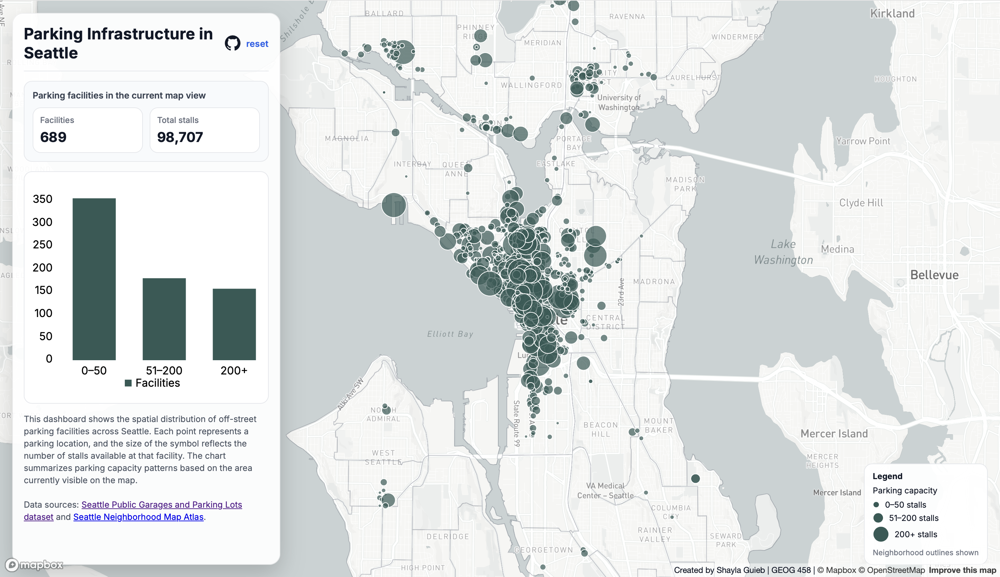

## Parking Infrastructure in Seattle
*A smart dashboard by Shayla Guieb*

#### AI Disclaimer
I used AI in this assignment for: debugging and explaining error messages, such as when running into mapbox issues or styling issues I had with the interface. I did not use AI to write or complete any components where AI use is prohibited. If AI was used for debugging or development, I am able to explain the relevant code and decisions.

### Overview
This interactive dashboard looks at where off-street parking facilities are located across Seattle and how large they are in terms of capacity. The dashboard combines an interactive map with summary numbers and a chart so users can explore patterns in parking availability across different parts of the city.

Each point on the map represents a parking facility, and the size of the circle shows how many stalls are available there. Larger circles indicate garages with more capacity, while smaller ones represent smaller lots. 

One of the main things that stands out is how concentrated large parking facilities are in downtown Seattle compared to other neighborhoods.

### Dashboard Preview

*The dashboard combines an interactive map with summary statistics and a chart to help explore parking patterns across Seattle.*

**View the dashboard** [here](https://sjg2202.github.io/seattle-parking-dashboard/)

### Propoprtional Symbol Map
I chose a proportional symbol map because the data represent individual parking locations, and each location has a different number of stalls. Changing the circle based on the stall count makes it easy to compare facilities directly. 
A chloropleth map wouldn't have worked as well because the data aren't grouped by area. Using proportional symbols keeps the true locations visible while also showing differences in capacity.

### Visual Compponents
In addition to the map, the dashboard includes:
- Dynamic counts showing the number of facilities and total stalls currently visible on the map
- A bar chart summarizing facilities by size categories (0–50, 51–200, and 200+ stalls)
- Popups that display facility names and stall counts when clicking a location

These elements update automatically as the user moves around the map.

### Data Sources
This project uses two geospatial (GeoJSON) datasets.
- [Seattle Public Garages and Parking Lots](https://data-seattlecitygis.opendata.arcgis.com/datasets/3029d63401544cd6b9783ef1bfb40b91_1/explore?location=47.595342%2C-122.334243%2C13)
*locations and stall counts for parking facilities*
 

- [Seattle Neighborhood Map Atlas](https://data-seattlecitygis.opendata.arcgis.com/datasets/SeattleCityGIS::neighborhood-map-atlas-neighborhoods/explore?location=47.614610%2C-122.336918%2C11)
*neighborhood boundary outlines for context*
